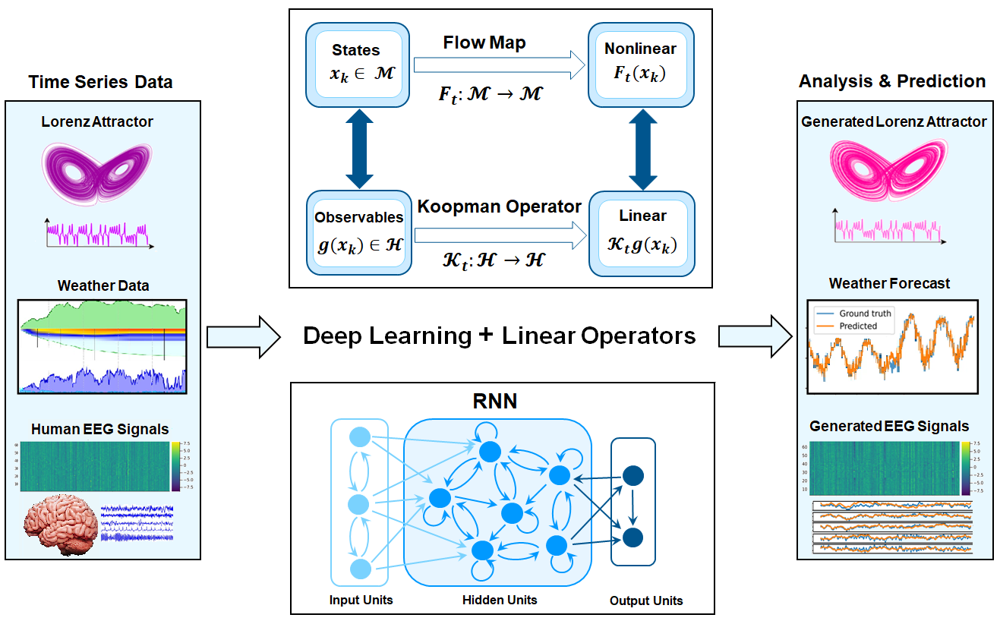
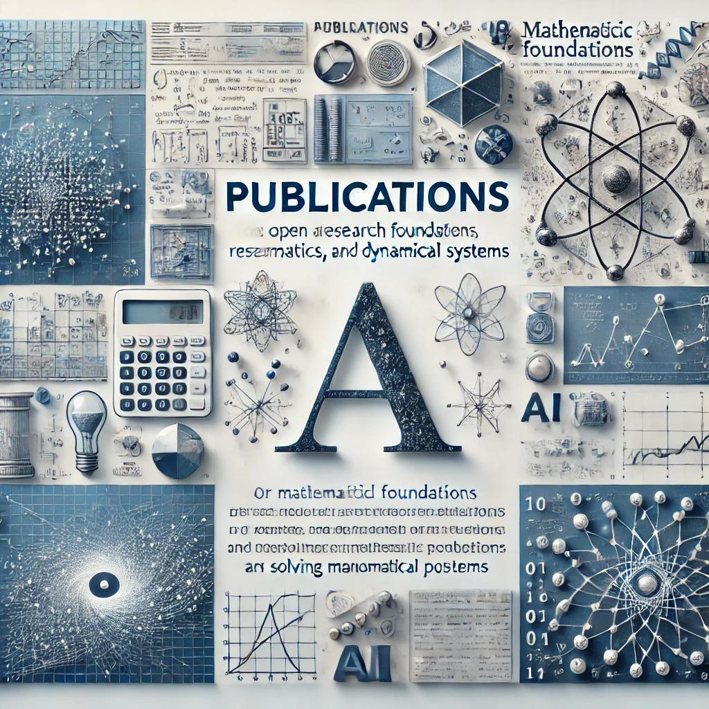
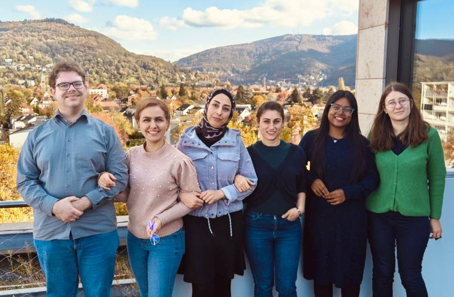

---
---

# Dynamical System and AI Website

## Welcome! 

Our group (started September 2024) is funded by the **Federal Ministry of Education and Research (BMBF)** through project OIDLITDSM in the field of AI. It is located at the **Interdisciplinary Center for Scientific Computing (IWR)**, Heidelberg University.

  

## Research

**We are mainly interested in two research directions**:

### **Mathematical Foundations of AI**. 
We aim to develop a mathematical foundation for understanding the design, training, and operation of deep learning models, particularly Recurrent Neural Networks (RNNs), which are effective neural architectures for time series analysis, forecasting, and modeling dynamical systems. We integrate dynamical systems theory, specifically Koopman operator theory, into the field of AI to establish a rigorous framework for creating novel, theoretically motivated AI algorithms and architectures for interpretable data-driven modeling of complex dynamical systems. 

### **AI for Solving Mathematical Problems**. 
There has been a substantial paradigm shift in the field of mathematics, particularly in applied mathematics, due to the utilization of AI techniques. In this context, we use neural networks to analyze and develop numerical algorithms for approximating solutions to Partial Differential Equations (PDEs) through machine learning approaches. We will also examine some mathematical inverse problems, such as determining governing differential equations from given datasets with such techniques.

## Publications

Our research focuses on advancing the mathematical understanding of AI, particularly in deep learning and dynamical systems. We aim to create innovative, interpretable algorithms that solve real-world challenges in neuroscience, climate science, and beyond.

  

For more details, visit our [Publications Page](publication/).

## Other directions
Another focus of our group is developing deep learning frameworks to enhance neuroimaging analysis by integrating various types of brain imaging data. This approach merges structural and functional information to better understand brain health, particularly in relation to neurodegenerative diseases. This methodology aims to identify patterns in brain structure and activity, which could improve diagnostic accuracy and monitor disease progression.

## Applications

We will apply our methodological tools and results in various fields, including neuroscience, weather and climate, economics, engineering, healthcare, etc.



## Our Team

  

**In our lab, we value collaboration, equality, diversity, and inclusion. We also respect our differences and strive to bring out the best in each other.**

