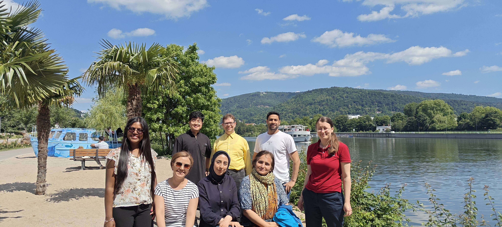

<h1 style="font-weight: 800; font-size: 3em; text-align: center;">
   Team
</h1>

  In our lab, we value collaboration, equality, diversity and inclusion. We also respect our differences, and try to get the best out of it.



  



## Current Members

  
  
  
    
  



## Former Members

  
  
    
  

