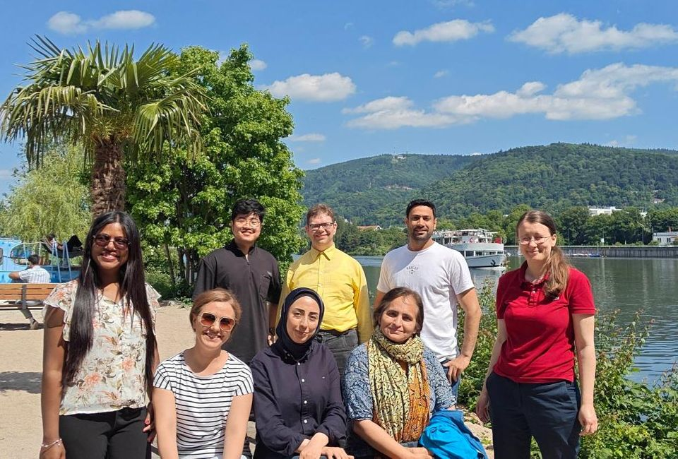

  <h1 class="big-heading">
     Team
  </h1>
  
  

    In our lab, we value collaboration, equality, diversity and inclusion. 
    We also respect our differences, and try to get the best out of it.
  



  



## Current Members

  
  
  
    
  



## Former Members

  
  
    
  

